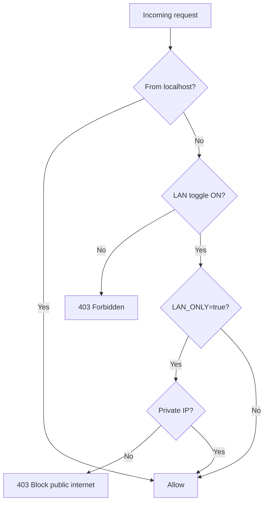
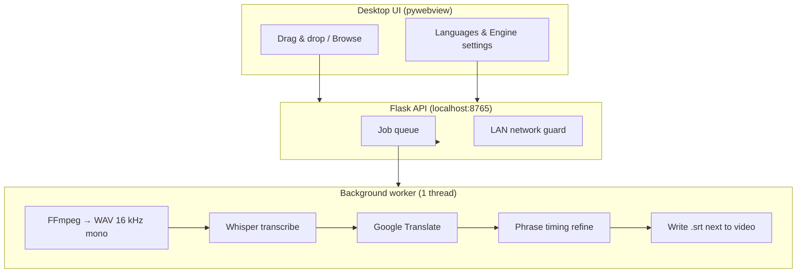

# Subtitles Generator

> **Turn any video into professional `.srt` subtitle files** — locally, on your PC, powered by [OpenAI Whisper](https://github.com/openai/whisper).  
> No cloud upload. No subscription. Drag, drop, pick languages, done.

Inspired by [auto-subtitle](https://github.com/m1guelpf/auto-subtitle) — rebuilt as a portable, queue-based desktop app with a glassmorphism UI, GPU acceleration, phone/tablet support, and cinema-style phrase timing.

---

## Start here — double-click `run.bat`

**This is the only step you need to remember.**

1. Open the project folder on your PC.
2. **Double-click `run.bat`.**
3. Leave the black console window open while the app runs.
4. When the app window appears, you are ready to add videos.

That is it. You do **not** need to install Python manually, run pip commands, or open a terminal — `run.bat` handles everything on first launch and every launch after.

```
Subtitles-Generator/
└── run.bat   ← double-click this
```

> **Keep the console window open.** Closing it stops the app.  
> **First run takes longer** (venv, packages, FFmpeg, Whisper model download). Later launches are much faster.

---

## Table of contents

1. [60-second workflow](#60-second-workflow-after-runbat-opens-the-app)
2. [What `run.bat` does for you](#what-runbat-does-for-you-automatically)
3. [Full tutorial — PC workflow](#full-tutorial--pc-workflow)
4. [Subtitle output](#subtitle-output)
5. [Languages & translation](#languages--translation)
6. [Whisper models — which one to pick](#whisper-models--which-one-to-pick)
7. [Phrase timing vs word-level timestamps](#phrase-timing-vs-word-level-timestamps)
8. [GPU / CUDA acceleration](#gpu--cuda-acceleration)
9. [Phone & tablet (LAN access)](#phone--tablet-lan-access)
10. [Security & privacy](#security--privacy)
11. [System tray & background use](#system-tray--background-use)
12. [Built-in “How to Use” tour](#built-in-how-to-use-tour)
13. [Supported video formats](#supported-video-formats)
14. [Advanced configuration (`.env`)](#advanced-configuration-env)
15. [Troubleshooting](#troubleshooting)
16. [Project structure](#project-structure)
17. [How it works (architecture)](#how-it-works-architecture)
18. [Logs & debugging](#logs--debugging)
19. [Helper scripts](#helper-scripts)
20. [Requirements](#requirements)
21. [FAQ](#faq)

---

## 60-second workflow (after `run.bat` opens the app)

| Step | Action |
|------|--------|
| 1 | **Drag & drop** videos or folders onto the window — or click **Browse files** / **Browse folder** |
| 2 | Set **Source language** (spoken in the video). `Auto` works for most content. |
| 3 | Check every **Subtitle language** you want (e.g. `en`, `es`, `fr`) |
| 4 | Click **Process All** |
| 5 | Wait for the progress bar. SRT files appear **next to each video** on disk |

**Example result:**

```
MyVacation.mp4
MyVacation - (en).srt
MyVacation - (es).srt
MyVacation - (fr).srt
```

---

## What `run.bat` does for you (automatically)

Every time you double-click `run.bat`, it runs this pipeline — you never touch the command line:

```mermaid
flowchart LR
    A[Double-click run.bat] --> B[Find Python 3.10+]
    B --> C[Create venv if missing]
    C --> D[Copy .env.example → .env if missing]
    D --> E[pip install requirements.txt]
    E --> F[Install CUDA PyTorch if NVIDIA GPU]
    F --> G[Download FFmpeg if missing]
    G --> H[Launch subtitles_generator.py]
    H --> I[Desktop app window opens]
```



| Stage | What happens |
|-------|----------------|
| **Python** | Prefers 3.10 → 3.11 → 3.12 → 3.13 via the Windows `py` launcher |
| **Virtual env** | Creates `venv/` inside the project (fully portable) |
| **`.env`** | Auto-created from `.env.example` on first run |
| **Packages** | Flask, Whisper, PyTorch, pywebview, translators, etc. |
| **CUDA** | `scripts\install_cuda_torch.ps1` detects NVIDIA GPU and installs matching PyTorch |
| **FFmpeg** | `scripts\install_ffmpeg.ps1` downloads a portable build if not in PATH |
| **Launch** | Opens a native desktop window at `http://127.0.0.1:8765` |

**Console output you should expect:**

```
This PC:  http://127.0.0.1:8765
Phone:    enable "Allow LAN access" in Settings (off by default)
Firewall: if phone cannot connect, run scripts\allow_lan_firewall.ps1 as Admin
Close this window to stop the app.
```

---

## Full tutorial — PC workflow

### Step 1 — Launch

Double-click **`run.bat`**. Wait until the app window appears.

- First launch: **5–20 minutes** depending on internet speed (PyTorch + Whisper model).
- Later launches: usually **under 30 seconds**.

### Step 2 — Add videos

Three ways to add content:

| Method | How |
|--------|-----|
| **Drag & drop** | Drop video files or entire folders anywhere on the app window |
| **Browse files** | Click the button in the drop zone; pick one or more videos |
| **Browse folder** | Pick a folder — all supported videos inside are scanned recursively |

Videos are **referenced by path** (not copied), except when uploaded from a phone (see [LAN section](#phone--tablet-lan-access)).

### Step 3 — Configure languages

**Global defaults** (sidebar → Languages) apply to every video unless you override one card.

1. **Source language** — what is spoken in the video.  
   - Use **Auto** for mixed or unknown content.  
   - Set explicitly (e.g. `Japanese`) if detection is wrong.

2. **Target languages** — check every language you want subtitles in.  
   - Tap **☆** next to a language to pin it as a **favorite** (sorted to the top).  
   - Favorites are saved in `user_settings.json` on your PC.

3. **Per-video override** — click **Select** on a card, then change languages for that file only.

### Step 4 — Choose engine settings (optional)

| Setting | Default | Recommendation |
|---------|---------|----------------|
| **Whisper model** | `base` | `base` for speed · `large-v3` for best quality on GPU |
| **Use CUDA / GPU** | ON | Leave ON with NVIDIA GPU; turn OFF to force CPU |
| **Word-level timestamps** | **OFF** | Leave OFF for normal movie-style subtitles |

### Step 5 — Process

| Button | Effect |
|--------|--------|
| **Process All** | Queues every video with its target languages |
| **Process** (on one card) | Queues only that video |

Jobs run **one at a time** in a background worker thread. The queue panel shows `Processing… (N in queue)` or `Queue idle`.

### Step 6 — Collect your files

When a job finishes:

- SRT is written **beside the video file** on disk: `VideoName - (lang).srt`
- The card shows **↓ en.srt** download links (useful on phone/LAN)
- Click **Open folder** (PC only) to jump to the video in Explorer
- Click **Remove** to drop the card from the queue (does not delete the video)

### Step 7 — Stop the app

Close the app window, then press any key in the `run.bat` console — or just close the console window.

---

## Subtitle output

### Naming convention

```
{video-filename} - ({language-code}).srt
```

| Video | Language | Output file |
|-------|----------|-------------|
| `lecture.mp4` | English | `lecture - (en).srt` |
| `lecture.mp4` | Spanish | `lecture - (es).srt` |
| `clip.mkv` | Japanese | `clip - (ja).srt` |

### Standard SRT format

```srt
1
00:00:01,080 --> 00:00:03,180
Hello and welcome.

2
00:00:04,500 --> 00:00:07,200
Today we will learn something new.
```

Compatible with VLC, MPC-HC, Plex, DaVinci Resolve, Premiere, YouTube upload, etc.

### Smart re-run behavior

If `Video - (en).srt` **already exists**, that language is **skipped** automatically — safe to re-run after adding new target languages.

---

## Languages & translation

### Source language (transcription)

Whisper supports **90+ languages** including Auto-detect. The UI lists every language Whisper can transcribe.

### Target language (translation)

When target ≠ source, segments are translated via **Google Translate** (`deep-translator`). Translation runs in batches with automatic retries.

| Scenario | What happens |
|----------|--------------|
| Target = source (e.g. `en` → `en`) | Transcription only — no translation |
| Target ≠ source (e.g. `es` → `en`) | Transcribe in source, translate to target |
| Source = Auto | Whisper detects spoken language first |

> **Tip:** For best accuracy, set source language explicitly when you know it.

---

## Whisper models — which one to pick

Change the model in **Settings → Engine → Whisper model**. The model file is cached in `models/` after first download.

| Model | Speed | Quality | VRAM (approx.) | Best for |
|-------|-------|---------|------------------|----------|
| `tiny` / `tiny.en` | Fastest | Lowest | ~1 GB | Quick drafts, English-only with `.en` |
| `base` / `base.en` | Fast | Good | ~1 GB | **Default — balanced daily use** |
| `small` / `small.en` | Medium | Better | ~2 GB | Cleaner dialogue |
| `medium` / `medium.en` | Slow | High | ~5 GB | Podcasts, interviews |
| `large-v3` | Slowest | **Best** | ~10 GB | Final exports, GPU recommended |
| `large-v2` / `large` | Very slow | Excellent | ~10 GB | Legacy large models |
| `turbo` | Fast | High (EN-focused) | ~6 GB | English content, speed/quality balance |

**Rules of thumb:**

- **No NVIDIA GPU** → stay on `tiny` or `base`, CUDA toggle OFF.
- **8 GB VRAM** → `base` or `small` comfortably; `large-v3` may work.
- **12+ GB VRAM** → `large-v3` for production quality.
- **English-only videos** → `.en` variants are faster (skip multilingual detection).

Changing model or CUDA setting **unloads and reloads** Whisper automatically.

---

## Phrase timing vs word-level timestamps

### Default: cinema-style phrase timing (recommended)

**Word-level timestamps are OFF by default.** The app still uses Whisper word timings internally, then refines cues for natural reading:

- Small **lead-in** before speech starts
- **Trail-out** after the last word
- **Minimum gap** between consecutive subtitles
- **Min/max duration** per cue

Result: subtitles that feel like a movie — not karaoke-style flashing text.

### Optional: word-level timestamps

Enable **Word-level timestamps** in Settings when you need:

- Karaoke-style highlighting
- Per-word precision for editing in a DAW/NLE
- Linguistic analysis

Each word becomes its own SRT cue. Best when output language matches spoken language.

---

## GPU / CUDA acceleration

| Badge in UI | Meaning |
|-------------|---------|
| `GPU: {name} (cuda)` | Whisper is running on your NVIDIA GPU |
| `GPU available — CPU mode` | GPU detected but CUDA toggle is OFF |
| `CPU mode (no CUDA detected)` | No NVIDIA GPU or drivers missing |

`run.bat` runs `scripts\install_cuda_torch.ps1` which:

1. Detects `nvidia-smi`
2. Tries CUDA wheels: `cu128` → `cu126` → `cu124` → `cu121`
3. Falls back to CPU PyTorch if all fail

**No action needed** on most gaming/workstation PCs with current NVIDIA drivers.

---

## Phone & tablet (LAN access)

> **LAN access is OFF by default.** You must enable it in Settings before any phone can connect.

### Why `127.0.0.1` fails on a phone

`127.0.0.1` always means **“this device itself.”** On your phone, that URL points to the phone — not your PC.

### Setup (5 steps)

1. Double-click **`run.bat`** on the PC (app must be running).
2. In the app sidebar, enable **Allow LAN access (phone/tablet)**.
3. Connect phone to the **same Wi‑Fi** as the PC (not guest network).
4. Expand **📱 Same Wi‑Fi** in the sidebar — open the URL shown (e.g. `http://192.168.1.42:8765`).  
   Or tap **▣** to scan the **QR code**.
5. On the phone: use **Browse files** to upload videos from that device. Processing still runs on the PC.

### Download subtitles on phone

When processing completes, tap **↓ en.srt** (or other language) on the video card.

### Turn LAN off when done

Disable **Allow LAN access** — remote devices on your Wi‑Fi get **403 Forbidden** immediately. Your PC still works at `127.0.0.1`.

### Firewall blocked?

Right-click PowerShell → **Run as Administrator**:

```powershell
cd path\to\Subtitles-Generator
.\scripts\allow_lan_firewall.ps1
```

This adds an inbound rule for TCP port **8765**.

### Phone can't connect?

| Symptom | Likely cause | Fix |
|---------|--------------|-----|
| Page never loads | **AP / client isolation** on router | Disable isolation in router admin; avoid guest Wi‑Fi |
| Page never loads | Windows Firewall | Run `allow_lan_firewall.ps1` as Admin |
| Connection refused | App not running | Double-click `run.bat` again |
| 403 Forbidden | LAN toggle OFF | Enable **Allow LAN access** in Settings |
| Blank page | Wrong URL | Use LAN IP from sidebar, not `127.0.0.1` |

**Quick ping test:** From the phone, ping the PC's LAN IP. No reply = network isolation or firewall — not an app bug.

---

## Security & privacy

### Is this on the public internet?

**No — not by default.**



| Protection | Default | What it does |
|------------|---------|--------------|
| **LAN access toggle** | OFF | Blocks all non-localhost clients with 403 |
| **LAN_ONLY** | ON | Rejects public IPs (8.8.8.8, etc.) even if LAN is on |
| **Private LAN IPs** | — | `192.168.x.x`, `10.x.x.x`, `172.16–31.x.x` only |
| **No cloud upload** | — | Videos stay on your machine; Whisper runs locally |

**Never port-forward port 8765 on your router** unless you fully understand the risk.

### What leaves your PC?

| Data | Leaves PC? |
|------|------------|
| Video files | **No** — processed locally |
| Audio for Whisper | **No** — extracted to `logs/audio_cache/`, deleted after use |
| Translation text | **Yes** — text segments sent to Google Translate API when target ≠ source |
| QR code | **Yes** — generated via `api.qrserver.com` (URL only, when you open QR modal) |

---

## System tray & background use

When the desktop window opens, a **system tray icon** may appear (bottom-right taskbar).

| Tray action | Effect |
|-------------|--------|
| **Open app** | Focus the main window |
| **Show tray drop target** | Small floating chip — drag videos onto it |
| **Import folder…** | Pick a folder via file dialog |
| **Quit** | Exit the application |

Useful when you want to drop files without bringing the main window forward.

---

## Built-in “How to Use” tour

Click **How to Use** in the top bar for a **12-step interactive guide** (powered by [driver.js](https://driverjs.com/)).

| Step | Topic |
|------|-------|
| 1 | Add videos (PC drag vs phone upload) |
| 2 | Video queue cards |
| 3 | Source language |
| 4 | Target languages & favorites |
| 5 | Process All |
| 6 | GPU / CPU badge |
| 7 | Whisper model picker |
| 8 | CUDA toggle |
| 9 | Word-level timestamps |
| 10 | LAN access toggle |
| 11 | Phone/tablet links & QR |
| 12 | Queue status |

The tour **never auto-runs** on startup — only when you click the button.

---

## Supported video formats

`.mp4` · `.mkv` · `.avi` · `.mov` · `.wmv` · `.flv` · `.webm` · `.m4v` · `.mpg` · `.mpeg` · `.3gp`

Any format FFmpeg can decode works. FFmpeg is auto-installed by `run.bat` if missing.

---

## Advanced configuration (`.env`)

On first run, `run.bat` copies `.env.example` → `.env`. Edit `.env` only when you need non-default behavior.

| Variable | Default | Description |
|----------|---------|-------------|
| `HOST` | `127.0.0.1` | Local URL host label |
| `PORT` | `8765` | Web UI port |
| `BIND_HOST` | `0.0.0.0` | Network bind address (LAN toggle enforces access) |
| `LAN_ONLY` | `true` | Block public internet IPs |
| `WHISPER_MODEL` | `base` | Starting model (also changeable in UI) |
| `WHISPER_DEVICE` | `cuda` | Preferred device hint |
| `USE_CUDA` | `true` | Default GPU toggle state in UI |
| `MODELS_DIR` | `models` | Whisper model cache folder |
| `FFMPEG_PATH` | *(empty)* | Custom `ffmpeg.exe` path; auto-detect if empty |
| `LOG_LEVEL` | `DEBUG` | Logging verbosity |
| `LOG_DIR` | `logs` | Log file directory |
| `MAX_QUEUE_SIZE` | `1000` | Maximum queued jobs |
| `TRANSLATION_BATCH_SIZE` | `20` | Segments per translation batch |
| `TRANSLATION_RETRY_COUNT` | `3` | Retries on translation failure |
| `DEBUG` | `false` | Flask debug mode (dev only) |

> **Note:** `Allow LAN access` and `Word-level timestamps` are **UI toggles only** — always **OFF** when the app opens. They are not controlled by `.env`.

---

## Troubleshooting

### `run.bat` says Python 3.10+ not found

1. Install Python from [python.org](https://www.python.org/downloads/) — check **“Add Python to PATH”**.
2. Double-click **`run.bat`** again.

### App window does not open (pywebview error)

The app falls back to your **default browser** at `http://127.0.0.1:8765`. Functionality is identical.

Install [WebView2 Runtime](https://developer.microsoft.com/microsoft-edge/webview2/) for the native window experience.

### `pip install` failed

1. Check internet connection.
2. Delete `venv/` folder.
3. Double-click **`run.bat`** to recreate the environment.

### FFmpeg not found / transcription fails immediately

1. Let `run.bat` auto-download FFmpeg.
2. Or install manually from [gyan.dev/ffmpeg/builds](https://www.gyan.dev/ffmpeg/builds/) into `ffmpeg\bin\`.
3. Or set `FFMPEG_PATH` in `.env`.

### CUDA not detected / very slow processing

1. Update NVIDIA drivers.
2. Re-run `run.bat` (triggers CUDA PyTorch install).
3. Try `scripts\install_cuda_torch.ps1` manually.
4. As last resort: turn **Use CUDA** OFF and use a smaller model (`tiny` / `base`).

### Subtitles appear too early / too late

Default **phrase timing** is tuned for natural viewing. For per-word precision, enable **Word-level timestamps** and re-process.

### Out of memory (large model)

Switch to `base` or `small`, or disable CUDA to use system RAM instead of VRAM.

### Port 8765 already in use

Change `PORT=8766` in `.env`, restart via **`run.bat`**.

### Where are the logs?

| File | Contents |
|------|----------|
| `logs/app.log` | Full debug trail |
| `logs/errors.log` | Errors only |
| `logs/events.jsonl` | Structured JSON events (one per line) |
| `logs/startup.log` | `run.bat` launch history |

---

## Project structure

```
Subtitles-Generator/
├── run.bat                    ← START HERE (double-click)
├── subtitles_generator.py     # Single-file app: UI + API + Whisper queue
├── requirements.txt
├── .env.example               # Config template (safe to publish)
├── .env                       # Your local config (created by run.bat; do not upload)
├── README.md
│
├── scripts/
│   ├── install_ffmpeg.ps1     # Portable FFmpeg downloader
│   ├── install_cuda_torch.ps1 # NVIDIA CUDA PyTorch installer
│   └── allow_lan_firewall.ps1 # Windows Firewall rule (run as Admin)
│
├── models/                    # Whisper weights (auto-downloaded, gitignored)
├── ffmpeg/                    # Portable FFmpeg (auto-installed, gitignored)
├── venv/                      # Python virtualenv (auto-created, gitignored)
├── logs/                      # Runtime logs (gitignored)
├── uploads/                   # Phone upload staging (gitignored)
└── user_settings.json         # Favorite languages (gitignored, auto-created)
```

---

## How it works (architecture)



**Design principles:**

- **Single worker** — one transcription at a time (stable GPU memory).
- **Idempotent** — existing SRT files are never overwritten unless removed manually.
- **Portable** — everything lives inside the project folder.
- **Opt-in networking** — LAN and word-level modes require explicit user action.

---

## Logs & debugging

Set `LOG_LEVEL=DEBUG` in `.env` for maximum detail. Set `LOG_LEVEL=INFO` for quieter logs.

Each structured event in `events.jsonl` includes a timestamp and event name — useful for tracing queue behavior, FFmpeg runs, and LAN blocks.

---

## Helper scripts

Run these manually only when `run.bat` automation is not enough:

| Script | When to use |
|--------|-------------|
| `scripts\install_ffmpeg.ps1` | FFmpeg download failed during `run.bat` |
| `scripts\install_cuda_torch.ps1` | GPU not detected after driver update |
| `scripts\allow_lan_firewall.ps1` | Phone cannot reach PC (run as **Administrator**) |

---

## Requirements

| Requirement | Details |
|-------------|---------|
| **OS** | Windows 10 or later |
| **Python** | 3.10 – 3.13 (3.10 recommended; auto-detected by `run.bat`) |
| **Internet** | Required on first run (packages + model download) |
| **GPU** | Optional — NVIDIA + CUDA for 5–20× faster transcription |
| **Disk** | ~2 GB for venv + base model; up to ~10 GB for `large-v3` |

---

## FAQ

**Do I need to install Python?**  
`run.bat` finds it automatically. Install Python 3.10+ only if the script reports it missing.

**Do videos get uploaded to the cloud?**  
No. Whisper runs entirely on your PC.

**Can I process multiple videos at once?**  
They queue automatically, but transcribe **one at a time** for stability.

**Can I use this on Mac or Linux?**  
This repo is Windows-focused (`run.bat`, pywebview Edge, tray). The Python script can run manually on other OS with adjustments.

**Why are LAN and word timestamps off by default?**  
Security (LAN) and readability (phrase timing). Both are opt-in.

**Can I change the port?**  
Yes — set `PORT` in `.env` and restart via **`run.bat`**.

**Where do phone uploads go?**  
`uploads/` folder on the PC. SRT output still saves next to the uploaded file path.

---

## Credits

- [OpenAI Whisper](https://github.com/openai/whisper) — speech recognition
- [auto-subtitle](https://github.com/m1guelpf/auto-subtitle) — original inspiration
- [deep-translator](https://github.com/nidhaloff/deep-translator) — subtitle translation
- [pywebview](https://pywebview.flowrl.com/) — native desktop window
- [driver.js](https://driverjs.com/) — interactive onboarding tour

---

<p align="center">
  <strong>Remember: double-click <code>run.bat</code> — everything else is optional.</strong>
</p>
